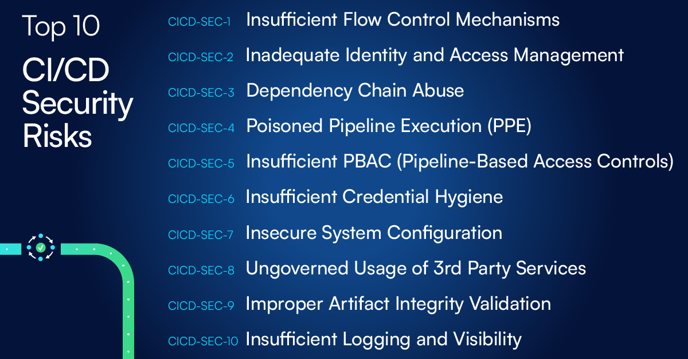

# Top 10 CI/CD Security Risks

## Introduction

CI/CD environments, processes, and systems are the beating heart of any modern software organization. They deliver code from an engineer’s workstation to production. Combined with the rise of the DevOps discipline and microservice architectures, CI/CD systems and processes have reshaped the engineering ecosystem:

* The technical stack is more diverse, both in relation to coding languages as well as to technologies and frameworks adopted further down the pipeline (e.g. GitOps, K8s).
* Adoption of new languages and frameworks is increasingly quicker, without significant technical barriers.
* There is an increased use of automation and Infrastructure as Code (IaC) practices.
* 3rd parties, both in the shape of external providers as well as dependencies in code, have become a major part of any CI/CD ecosystem, with the integration of a new service typically requiring no more than adding 1-2 lines of code.

These characteristics allow faster, more flexible and diverse software delivery. However, they have also reshaped the attack surface with a multitude of new avenues and opportunities for attackers.

Adversaries of all levels of sophistication are shifting their attention to CI/CD, realizing CI/CD services provide an efficient path to reaching an organization’s crown jewels. The industry is witnessing a significant rise in the amount, frequency and magnitude of incidents and attack vectors focusing on abusing flaws in the CI/CD ecosystem, including - 

* The compromise of the **SolarWinds** build system, used to spread malware through to 18,000 customers.
* The **Codecov** breach, that led to exfiltration of secrets stored within environment variables in thousands of build pipelines across numerous enterprises.
* The **PHP breach**, resulting in publication of a malicious version of PHP containing a backdoor.
* The **Dependency Confusion** flaw, which affected dozens of giant enterprises, and abuses flaws in the way external dependencies are fetched to run malicious code on developer workstations and build environments.
* The compromises of the **_ua-parser-js_, _coa_ and _rc_ NPM packages**, with millions of weekly downloads each, resulting in malicious code running on millions of build environments and developer workstations.

While attackers have adapted their techniques to the new realities of CI/CD, most defenders are still early on in their efforts to find the right ways to detect, understand, and manage the risks associated with these environments. Seeking the right balance between optimal security and engineering velocity, security teams are in search for the most effective security controls that will allow engineering to remain agile without compromising on security.

##  The "Top 10 CI/CD Security Risks" initiative

This document helps defenders identify focus areas for securing their CI/CD ecosystem. It is the result of extensive research into attack vectors associated with CI/CD, and the analysis of high profile breaches and security flaws.

Numerous industry experts across multiple verticals and disciplines came together to collaborate on this document to ensure its relevance to today’s threat landscape, risk surface, and the challenges that defenders face in dealing with these risks.

We would like to thank and acknowledge all experts which took part in reviewing and validating this document.

### Authors

* [Daniel Krivelevich](https://twitter.com/Dkrivelev) (CTO @ Cider Security)
* [Omer Gil](https://twitter.com/omer_gil) (Director of Research @ Cider Security)

### Reviewers

* [Iftach Ian Amit](https://twitter.com/iiamit) (Advisory CSO @ Rapid7)
* [Jonathan Claudius](https://twitter.com/claudijd) (CISO @ Jump Crypto)
* [Michael Coates](https://twitter.com/_mwc) (CEO & Co-Founder @ Altitude Networks, Former CISO @ Twitter)
* Jonathan Jaffe (CISO @ Lemonade Insurance)
* Adrian Ludwig (Chief Trust Officer @ Atlassian)
* [Travis McPeak](https://twitter.com/travismcpeak) (Head of Product Security @ Databricks)
* Ron Peled (Founder & CEO @ ProtectOps, Former CISO @ LivePerson)
* [Ty Sbano](https://twitter.com/tysbano) (CISO @ Vercel)
* [Astha Singhal](https://twitter.com/astha_singhal) (Director of Application Security @ Netflix)
* [Hiroki Suezawa](https://twitter.com/rung) (Security Engineer @ Mercari, inc.)
* Tyler Welton (Principal Security Engineer @ Built Technologies, Owner @ Untamed Theory)
* Tyler Young (Head of Security at Relativity)
* Noa Ginzbursky (DevOps Engineer @ Cider Security)
* [Asi Greenholts](https://twitter.com/TupleType) (Security Researcher @ Cider Security)

## Top 10 risks
Presented below are the top 10 CI/CD security risks. All risks follow a consistent structure - 

* **Definition** - Concise definition of the nature of the risk.
* **Description** - Detailed explanation of the context and the adversary motivation.
* **Impact** - Detail around the potential impact the realization of the risk can have on an organization.
* **Recommendations** - A set of measures and controls recommended for optimizing an organization’s CI/CD posture in relation to the risk in question.
* **References** - A list of real world examples and precedents in which the risk in question was exploited.

The list was compiled on the basis of extensive research and analysis based on the following sources:

* Analysis of the architecture, design and security posture of hundreds of CI/CD environments across multiple verticals and industries.
* Profound discussions with industry experts.
* Publications detailing incidents and security flaws within the CI/CD security domain. Examples are provided where relevant.

List of the top 10 CI/CD security risks:

[CICD-SEC-1](Risks/CICD-SEC-01-Insufficient-Flow-Control-Mechanisms.md): Insufficient Flow Control Mechanisms

[CICD-SEC-2](Risks/CICD-SEC-02-Inadequate-Identity-And-Access-Management.md): Inadequate Identity and Access Management

[CICD-SEC-3](Risks/CICD-SEC-03-Dependency-Chain-Abuse.md): Dependency Chain Abuse

[CICD-SEC-4](Risks/CICD-SEC-04-Poisoned-Pipeline-Execution.md): Poisoned Pipeline Execution (PPE)

[CICD-SEC-5](Risks/CICD-SEC-05-Insufficient-PBAC.md): Insufficient PBAC (Pipeline-Based Access Controls)

[CICD-SEC-6](Risks/CICD-SEC-06-Insufficient-Credential-Hygiene.md): Insufficient Credential Hygiene

[CICD-SEC-7](Risks/CICD-SEC-07-Insecure-System-Configuration.md): Insecure System Configuration

[CICD-SEC-8](Risks/CICD-SEC-08-Ungoverned-Usage-of-3rd-Party-Services.md): Ungoverned Usage of 3rd Party Services

[CICD-SEC-9](Risks/CICD-SEC-09-Improper-Artifact-Integrity-Validation.md): Improper Artifact Integrity Validation

[CICD-SEC-10](Risks/CICD-SEC-10-Insufficient-Logging-And-Visibility.md): Insufficient Logging and Visibility
